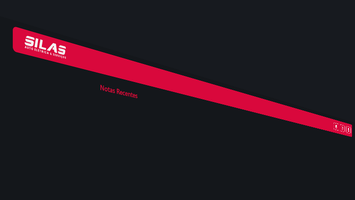

## 💻 Sobre Aplicativo

  Aplicação desenvolvida para elaboração de notas( Não fiscal), apenas utilizando
apenas HTML,CSS e JS. com intuito de aprendizagem.

## Detalhes

**Linguagens**

**DevOps**

**FrameWorks**

**Ferramentas de desenvolvimento**

 

## Onde me encontrar

<a href="https://instagram.com/samequemarques0" title="Perfil do Sameque">
  🖥 SAMEQUE MARQUES
</a>